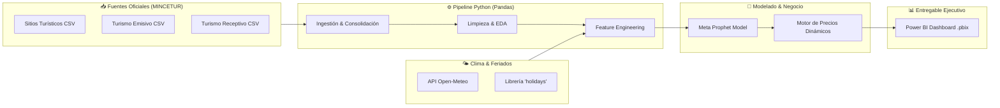

# Sistema de Predicción de Demanda Turística y Precios Dinámicos


> **Solución de Analítica Predictiva y Tarificación Dinámica** para la industria turística peruana. Integra datos históricos de afluencia, turismo receptivo/emisivo, datos climatológicos y calendarios festivos para proyectar la demanda de visitantes y sugerir ajustes porcentuales de precio.

La documentación detallada sobre arquitectura de datos, supuestos del modelo y especificaciones del producto se encuentra en la **[Wiki del Repositorio](../../wiki)**.

---

## 📋 Tabla de Contenidos
- [Visión General y Problema de Negocio](#-visión-general-y-problema-de-negocio)
- [Arquitectura de Datos y Fuentes](#-arquitectura-de-datos-y-fuentes)
- [Estructura del Repositorio](#-estructura-del-repositorio)
- [Lógica de Precios Dinámicos](#-lógica-de-precios-dinámicos)
- [Guía de Instalación y Ejecución Paso a Paso](#-guía-de-instalación-y-ejecución-paso-a-paso)
- [Visualización en Power BI](#-visualización-en-power-bi)

---

## 🎯 Visión General y Problema de Negocio

En el sector turismo, las tarifas de alojamiento y servicios a menudo se fijan mediante métodos intuitivos o comparaciones históricas simples del año anterior. Esto genera **pérdidas de ingresos en temporadas de alta demanda insospechada** y **baja ocupación en épocas valle**.

### Solución Desarrollada:
Este proyecto automatiza la toma de decisiones tarifarias integrando un flujo de ingeniería de datos y analítica predictiva:
1. **Consolidación Multifuente:** Unifica el flujo de visitantes a sitios turísticos con el comportamiento de turismo receptivo y emisivo.
2. **Variables Contextuales:** Incorpora variables exógenas como precipitaciones, temperaturas extremas de la zona y días festivos en Perú.
3. **Predicción con Prophet:** Modela series de tiempo capturando estacionalidades diarias, semanales y anuales.
4. **Motor de Precios:** Algoritmo que traduce la proyección de demanda en un porcentaje recomendado de variación de tarifas.
5. **Dashboard Ejecutivo:** Interfaz en Power BI para la toma rápida de decisiones gerenciales.

---

## 🔄 Arquitectura de Datos y Fuentes



### Orígenes de Datos Abiertos
- 🏛️ **Visitantes a sitios turísticos:** [Dataset Oficial MINCETUR](https://www.datosabiertos.gob.pe/dataset/visitantes-sitios-tur%C3%ADsticos-del-per%C3%BA-ministerio-de-comercio-exterior-y-turismo-mincetur)
- 🛫 **Turismo Emisivo:** [Dataset Oficial MINCETUR - Emisivo](https://www.datosabiertos.gob.pe/dataset/turismo-emisivo-en-el-per%C3%BA-ministerio-de-comercio-exterior-y-turismo-mincetur-0)
- 🛬 **Turismo Receptivo:** [Dataset Oficial MINCETUR - Receptivo](https://www.datosabiertos.gob.pe/dataset/turismo-receptivo-en-el-per%C3%BA-ministerio-de-comercio-exterior-y-turismo-mincetur)
- 🌡️ **Histórico Climatológico:** [Open-Meteo Historical Weather API](https://open-meteo.com/en/docs/historical-weather-api)

---

## 📁 Estructura del Repositorio

```text
├── data/
│   ├── raw/                  # Datasets brutos descargados de MINCETUR (.csv)
│   ├── processed/            # Dataset consolidado y limpio listo para el modelo (.csv)
│   └── outputs/              # Predicciones generadas y tabla de precios dinámicos (.csv)
├── notebooks/
│   ├── 01_data_ingestion.ipynb   # Extracción de datos y conexión a API Open-Meteo
│   ├── 02_eda.ipynb              # Análisis exploratorio, nulos y tratamiento de outliers
│   ├── 03_feature_engineering.ipynb # Preparación de matrices ds/y y feriados
│   └── 04_prophet_model.ipynb    # Entrenamiento del modelo y generación de pronósticos
├── src/
│   ├── ingestion.py          # Script de automatización de descarga y unión
│   ├── utils_climate.py      # Funciones auxiliares para llamadas a Open-Meteo API
│   ├── pricing_engine.py     # Lógica y fórmulas de la regla de precios dinámicos
│   └── train.py              # Script principal de ejecución del modelo predictivo
├── dashboard/
│   └── turismo_precios_dinamicos.pbix  # Archivo editable de Power BI Desktop
├── requirements.txt          # Lista de dependencias de Python
└── README.md                 # Documentación principal del repositorio
```

---

## 💰 Lógica de Precios Dinámicos

El motor de precios calcula el desvío porcentual de la demanda estimada ($\hat{y}$) frente al promedio histórico ($\mu_{hist}$):

$$\Delta_{\text{demanda}} = \frac{\hat{y} - \mu_{hist}}{\mu_{hist}} \times 100$$

| Variación de Demanda ($\Delta$) | Escenario de Mercado | Ajuste Sugerido de Precio |
| :--- | :--- | :---: |
| $\Delta \ge +30\%$ | Pico Extraordinario (Alta Demanda) | **+15%** |
| $+10\% \le \Delta < +30\%$ | Demanda Moderada Alta | **+8%** |
| $-10\% < \Delta < +10\%$ | Demanda Normal (Estándar) | **0% (Precio Base)** |
| $-30\% < \Delta \le -10\%$ | Temporada Baja | **-8%** |
| $\Delta \le -30\%$ | Valle Severo (Baja Demanda) | **-15%** |

---

## 🚀 Guía de Instalación y Ejecución Paso a Paso

Sigue estas instrucciones detalladas para clonar y ejecutar la solución en tu entorno local.

### Prerrequisitos
- **Python 3.10 o superior** instalado ([Descargar Python](https://www.python.org/downloads/)).
- **Git** instalado ([Descargar Git](https://git-scm.com/)).
- **Power BI Desktop** (opcional, para abrir el dashboard).

---

### Paso 1: Clonar el Repositorio
Abre tu terminal o PowerShell y ejecuta:

```bash
git clone https://github.com/archunknown/tourism-demand-forecasting.git
cd tourism-demand-forecasting
```

---

### Paso 2: Crear y Activar Entorno Virtual

**En Windows (PowerShell / CMD):**
```powershell
python -m venv venv
.\venv\Scripts\activate
```

**En Linux / macOS:**
```bash
python3 -m venv venv
source venv/bin/activate
```

---

### Paso 3: Instalar Dependencias de Python
Con el entorno virtual activado, instala las librerías necesarias:

```bash
pip install --upgrade pip
pip install -r requirements.txt
```

> [!NOTE]
> La librería `prophet` requiere compiladores de C++. Si experimentas algún problema en Windows, se instalarán los binarios precompilados especificados en `requirements.txt`.

---

### Paso 4: Ejecutar el Pipeline Analítico

#### Opción A: Ejecución interactiva desde VS Code (Notebooks)
1. Abre VS Code en la carpeta del proyecto: `code .`
2. Abre la carpeta `notebooks/` e inicia los cuadernos en orden numérico:
   - `01_data_ingestion.ipynb`
   - `02_eda.ipynb`
   - `03_feature_engineering.ipynb`
   - `04_prophet_model.ipynb`

#### Opción B: Ejecución automatizada vía Scripts en Consola
Ejecuta la secuencia limpia de comandos en la terminal:

```bash
# 1. Ingestión y consolidación de fuentes MINCETUR y clima
python src/ingestion.py

# 2. Entrenamiento del modelo Prophet y generación de precios dinámicos
python src/train.py
```

Al finalizar la ejecución, los archivos con las predicciones y recomendaciones de precios se guardarán automáticamente en la carpeta `data/outputs/`.

---

## 📊 Visualización en Power BI

1. Abre **Power BI Desktop**.
2. Dirígete a la carpeta `dashboard/` y abre el archivo `turismo_precios_dinamicos.pbix`.
3. Si cambiaste las rutas locales, actualiza la fuente de datos en Power BI apuntando a `data/outputs/predicciones_precios.csv`.
